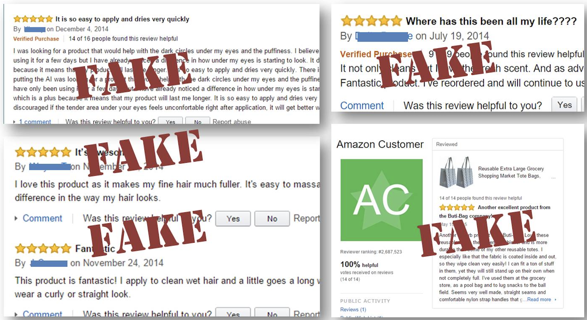
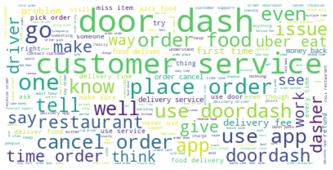
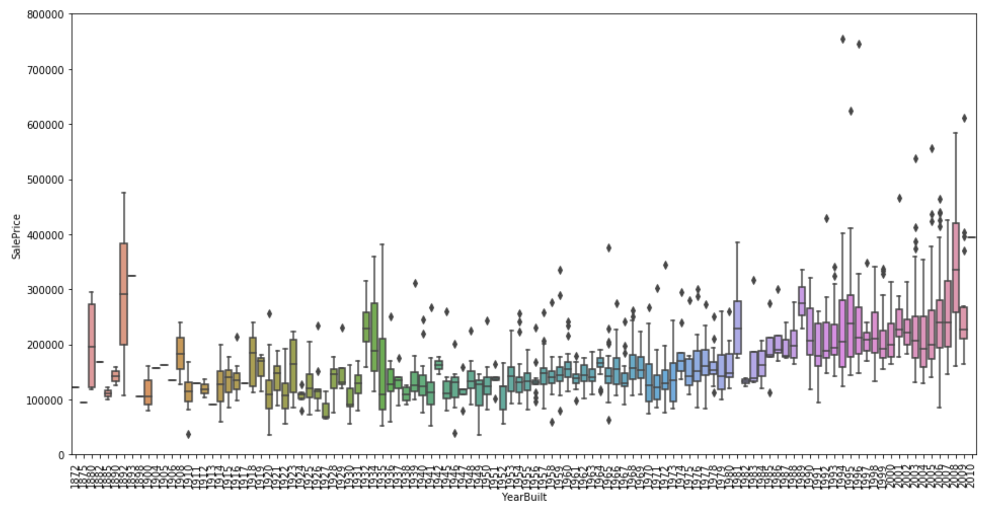
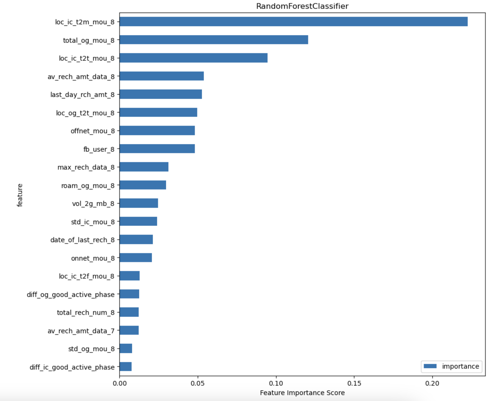

# Portfolio
---
A bird's eye view of some of the projects I have worked upon in my datascience journey. I update this from time to time as I continue working on some cool projects in my free time.

NLP Projects 

---

### Fake Reviews Detection

.ipynb)

Order the most popular item from a website and it turns out to be a cheap replica , happened to us all hasn't it? This project uses transfer learning techniques to identify fake reviews on a e-commerce website. 

---

## Machine Learning Projects 

### Appstore reviews segregation to extract actionable insights

For this project I have scraped appstore reviews of DoorDash app to extract valuable insights for app developers and owners. Through topic modelling it identifies reviews into different groups through which we can identify reviews wehre app users complain about  glitches after app updates.
.

 

 

---
### Housing Price Prediction

Lets make some money on real estate using machine learning :smiley:	. This project estimates the prices if houses using existing data through which a real estate company can determine whether to invest in a property and flip it for profits.

 

 

---

### Telecom Churn Case Study

One of the biggest problem telecom industry tackles, CHURN !! . This project implements PCA for feature reduction , handles class imbalance problem, builds ensemble models and fine-tunes hyperparameters.

 

 

---

Micro Projects 

### Website Traffic Analysis

 
